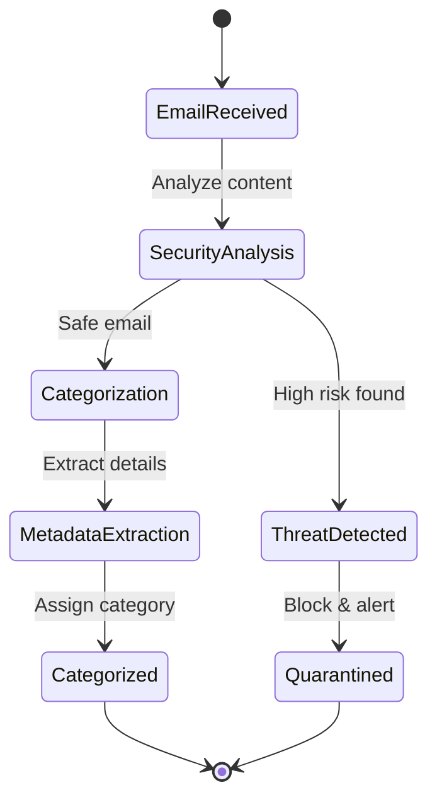

# State Flow - Enhanced Email Categorizer

## Business State Diagram

## State Definitions
- **EmailReceived**: New email enters the system for processing
- **SecurityAnalysis**: Scan for phishing patterns, suspicious URLs, and scam indicators
- **ThreatDetected**: High-risk email identified requiring immediate action
- **Quarantined**: Dangerous email blocked with user alert
- **Categorization**: Determine if email is Meeting, Delivery, or Important
- **MetadataExtraction**: Pull out dates, tracking numbers, meeting links
- **Categorized**: Email assigned to appropriate category with metadata

## Transitions
1. **Analyze content**: Every email undergoes security analysis first
2. **High risk found**: Phishing/scam detection triggers quarantine
3. **Safe email**: Proceed to categorization if no threats
4. **Block & alert**: Dangerous emails isolated immediately
5. **Extract details**: Pull relevant data based on category
6. **Assign category**: Final categorization with confidence score