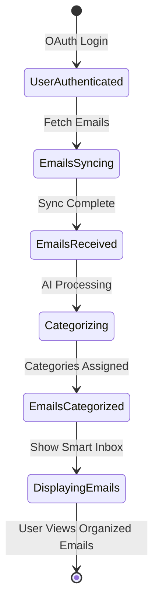

# State Flow - Smart Email Categorizer

## Business State Diagram

## State Definitions
- **UserAuthenticated**: User successfully logged in via Google OAuth
- **EmailsSyncing**: System fetching emails from Gmail API
- **EmailsReceived**: Raw emails loaded into system memory
- **Categorizing**: AI analyzing email content and assigning categories
- **EmailsCategorized**: All emails have AI-determined categories with confidence scores
- **DisplayingEmails**: Smart inbox showing categorized emails to user

## Transitions
1. **OAuth Login**: User clicks "Sign in with Google" and authorizes access
2. **Fetch Emails**: System initiates Gmail API sync for last 50 emails
3. **Sync Complete**: All emails retrieved and stored in database
4. **AI Processing**: Each email sent through categorization model
5. **Categories Assigned**: AI returns category + confidence for each email
6. **Show Smart Inbox**: Frontend displays emails grouped by category